# Backend Logic Flowchart

This document contains Mermaid flowcharts documenting the backend architecture and logic flows.

## Main Request Flow

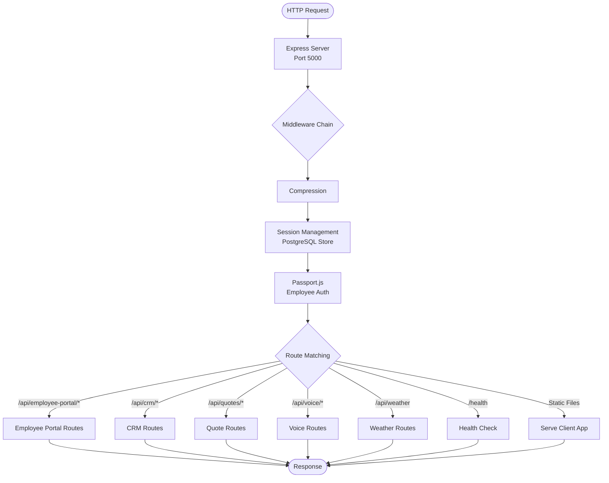

## Authentication Flows

### Employee Portal Authentication (Passport.js)

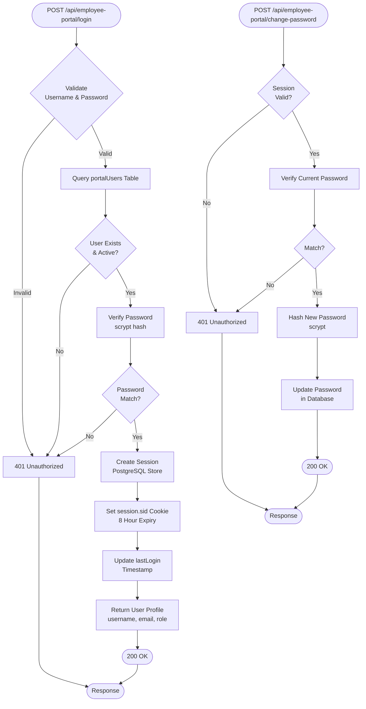

### CRM Authentication (Token-based)

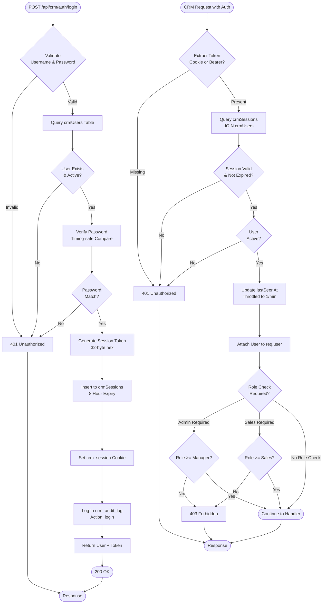

## Customer Management Flow

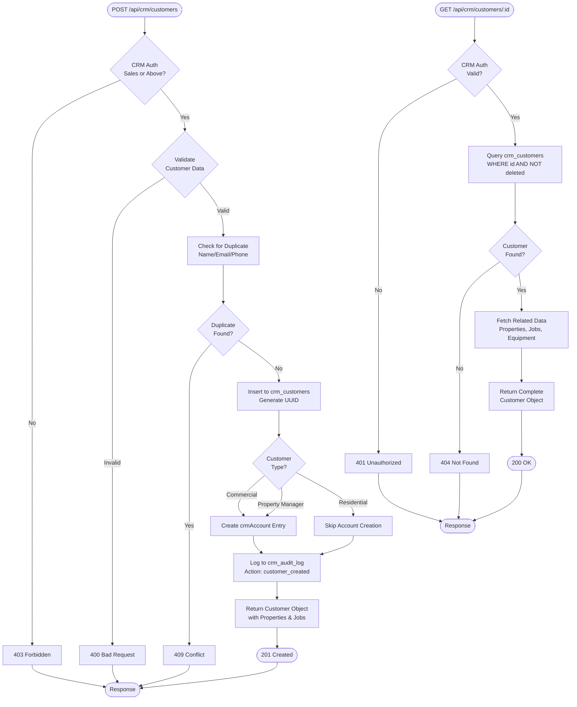

## Work Order & Dispatch Flow

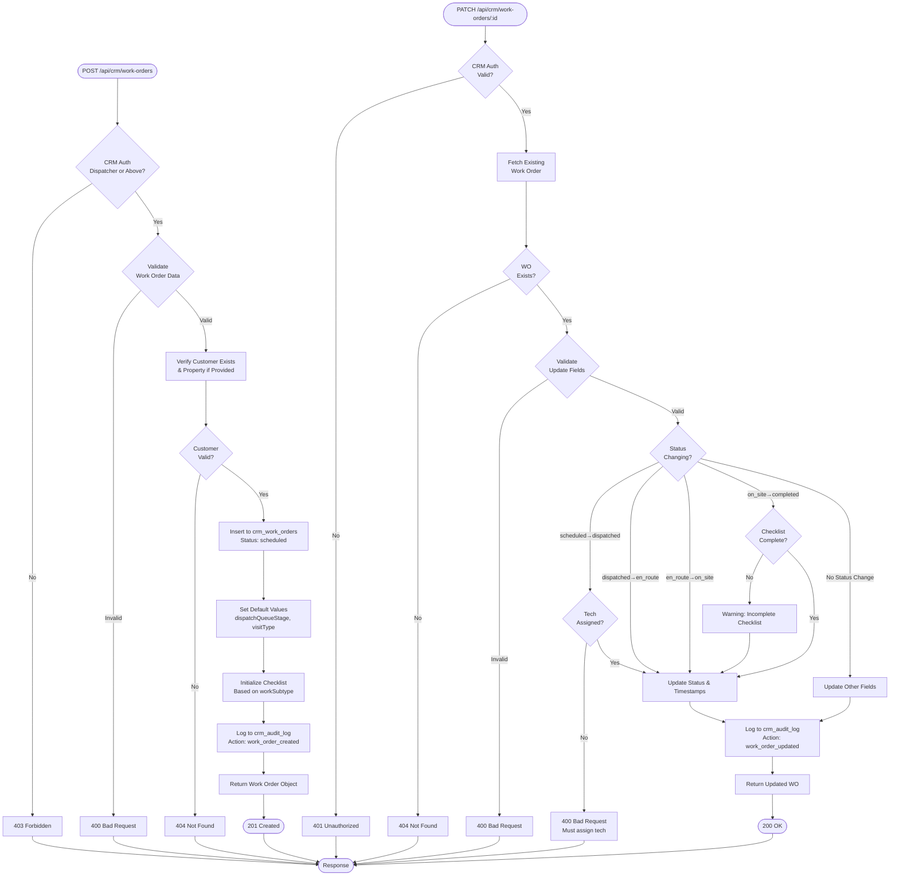

## Quote Generation Flow

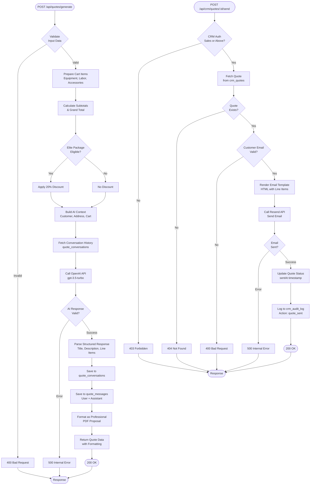

## Voice Transcription Flow

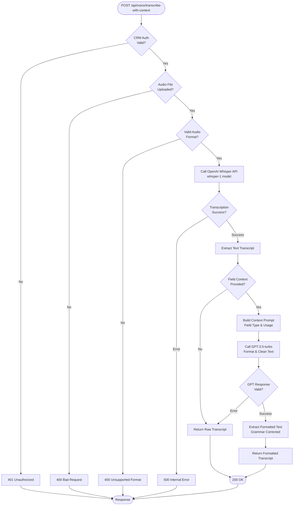

## Customer Sync from Google Sheets

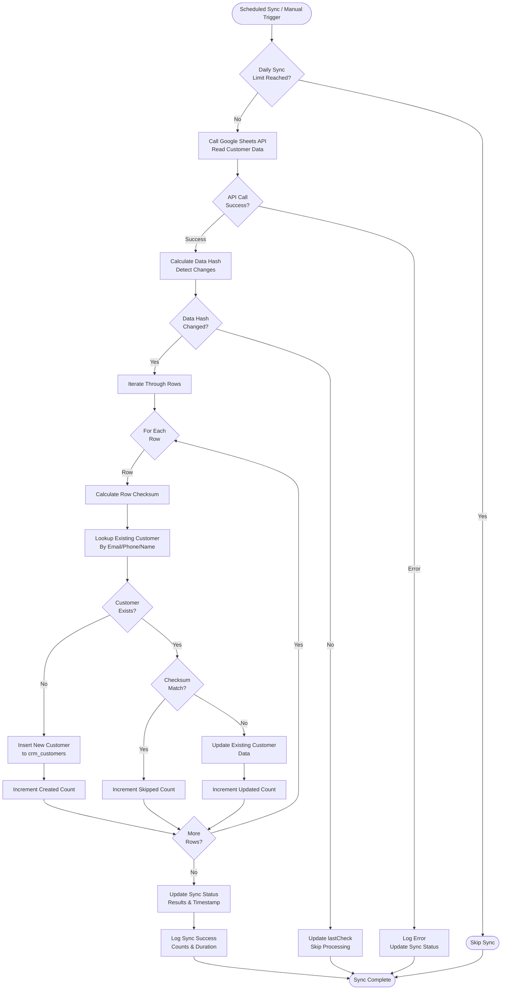

## Invoice & Payment Flow

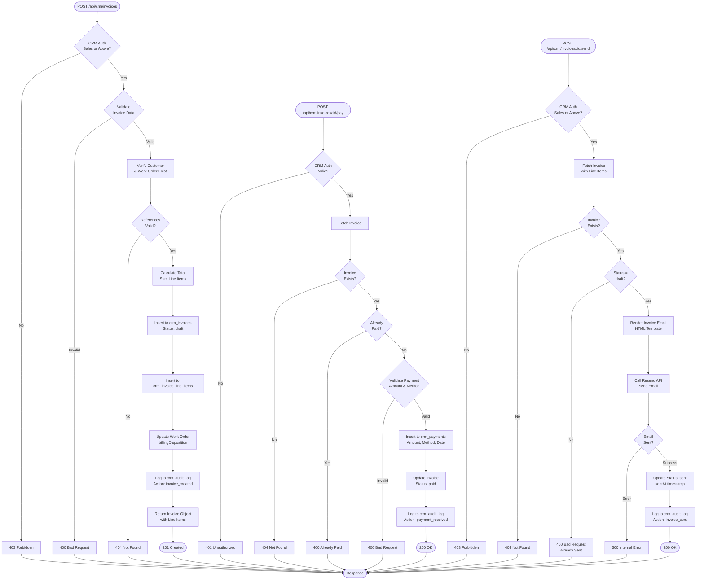

## Project Pipeline Flow

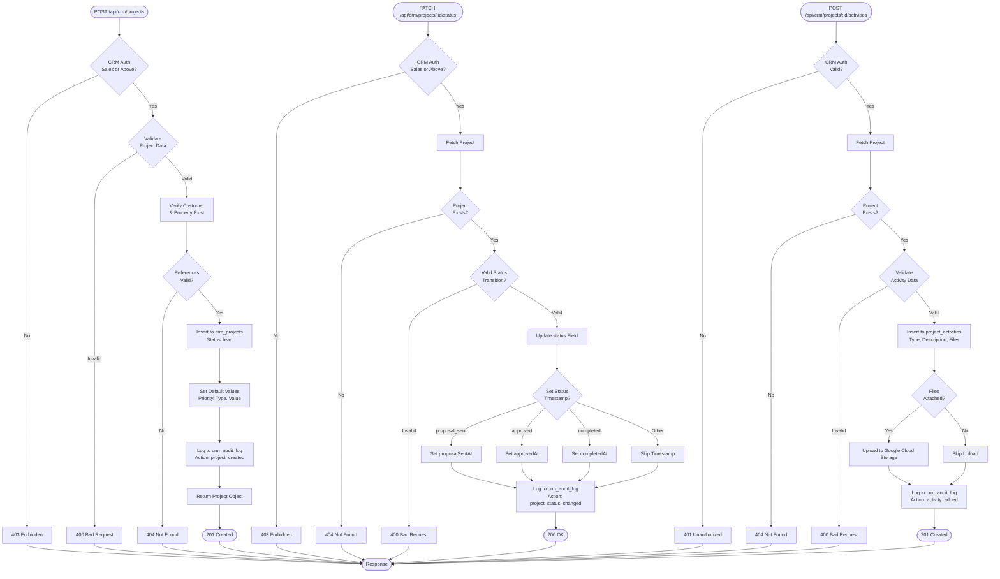

## Database Architecture

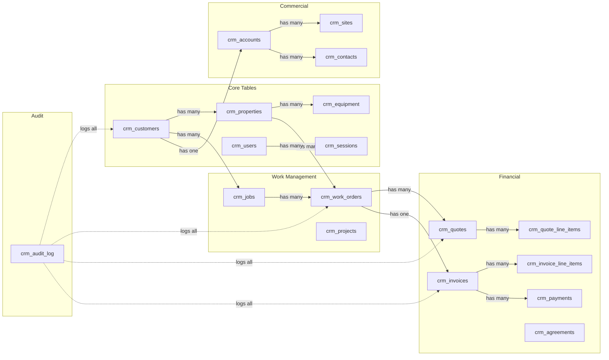

## External Service Integrations

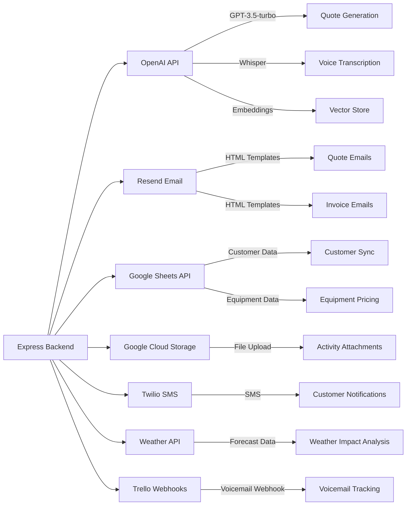

## Role-Based Access Control

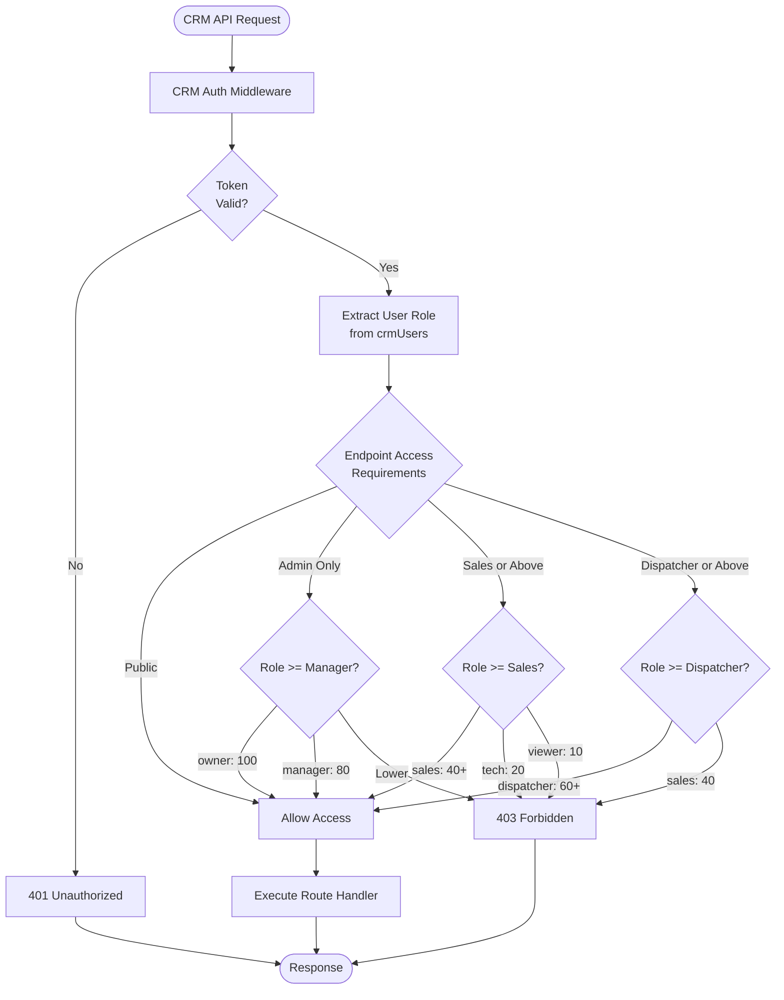
